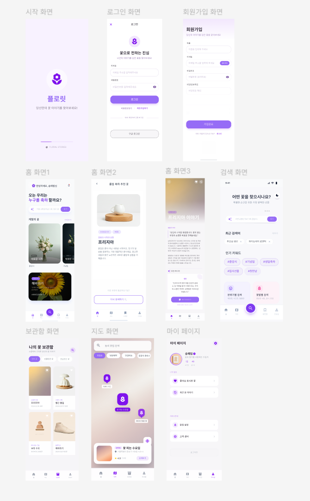

- 화면 별 설계 (네비게이션 바 별 정리)

1. 홈 화면
    
    1. 검색 창 화면 (ex: “ 친구가 이번에 대학교 졸업을 해서 축하해주고 싶어”)과 인기 키워드를 넣어 관련된 태그를 눌렀을 때 관련 있는 꽃들을 확인할 수 있음 (ex: #졸업식, #기념일, #생일축하)
        
    2. (Push 이동) 추천 결과 화면: 의미 중심의 카트 형 리스트
        
    
    → 단순히 꽃 이름만 나열하지 않고, 상황에 맞는 키워드 강조
    
    (ex: 프리지아 : #새로운 시작 #응원 “졸업은 끝이 아닌 새로운 시작이죠. 친구의 앞날을 응원하는 가장 대표적인 꽃이에요” … )
    
    꽃을 중심으로 이미지 보이고 아래 #태그, 텍스트
    
    c. (Push 이동) 상세 보기 화면 (추천 결과 화면에서 꽃 이미지를 클릭했을 때 보이는 페이지)
    
    : 꽃말 스토리 & 카드 문구
    
    꽃말의 유래와 짧은 스토리텔링 제공, 복사하기 버튼
    
    d. 태그를 눌렀을 때 태그에 맞는 기존에 만들었던 카드들을 띄우기
    
2. 보관함 화면 (나의 꽃 기록)
    
    1. 홈 화면에서 추천 받은 꽃에서 맘에 드는 꽃들을 저장하면 볼 수 있는 페이지
    
    저장한 꽃들과 AI 문구들을 리스트/그리드 형태로 보임
    
3. 지도 기반 로컬 꽃집 추천 화면
    
    1. 현재 위치나 근처 꽃집을 지도에 표시
    2. 필터링 기능: "졸업식 시즌용 꽃다발 가능", "프리지아 재고 있음" 등의 태그 제공
    3. 상태 정보: 가게 별 영업시간과 리뷰, 그리고 해당 꽃집이 '꽃말 카드' 제작이 가능한지 표시
4. 마이 페이지
    
    1. 좋아요 누른 꽃을 볼 수 있는 페이지 제공
    
    **피그마 UI 화면**
    
    